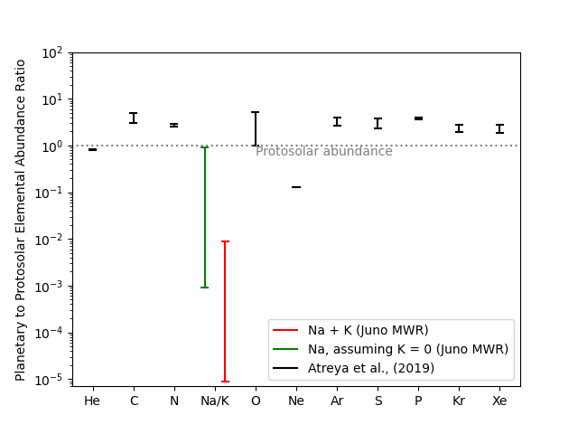

👋 Welcome! I'm Ananyo Bhattacharya, a space scientist and engineer bridging scientific research with technological innovation. I am a Research Fellow at Department of Climate and Space Sciences and Engineering, University of Michigan.

I am working on problems at intersection of natural sciences and engineering focused on understanding Earth and outer space. At University of Michigan's [Atmospheric Dynamics Modeling Laboratory](https://admg.engin.umich.edu), I work on technical development of [NOAA Unified Forecast System](https://ufs.epic.noaa.gov) for operational weather forecasting over the Great Lakes region. Short-term weather forecasting provides insights on lake effect winter storms, rainfall patterns and sources of moisture. I am also working with applications of deep learning models for Earth System Modeling. Emerging technologies in machine learning combined with physics based methods help us to take on challenging problems.

I am also a scientific collaborator to [NASA Juno mission](https://science.nasa.gov/mission/juno/) to Jupiter. I have led projects focused on Microwave Radiometry applications to sensing Jupiter's deep clouds and its space environment. I completed my Ph.D. in Climate and Space Sciences and Engineering from University of Michigan with a Graduate Certificate in Entrepreneurship and Innovation. I also received summer research fellowships to intern at NASA Jet Propulsion Laboratory and Los Alamos National Laboratory. Before my graduate studies, I completed my undergraduate education in Mechnical Engineering from Sardar Vallabhbhai National Institute of Technology Surat, India.

------

    

        

            
        

        

            
        

        

            
        

    

    <!-- Navigation buttons -->
    <button class="carousel-button prev">&#10094;</button>
    <button class="carousel-button next">&#10095;</button>

    <!-- Indicators -->
    

   

------
