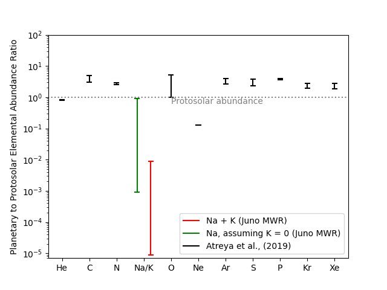
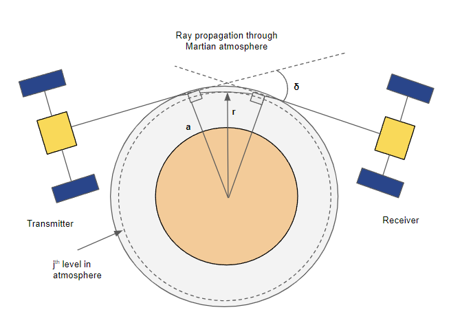



Highly depleted Alkali metals in Jupiter's deep atmosphere
======
[Astrophysical Journal Letters paper](https://iopscience.iop.org/article/10.3847/2041-8213/ace115)

Water and ammonia vapors are known to be the major sources of spectral absorption at pressure levels observed by the microwave radiometer (MWR) on Juno. However, the brightness temperatures and limb darkening observed by the MWR at its longest-wavelength channel of 50 cm (600 MHz) in the first nine perijove passes indicate the existence of an additional source of opacity in the deep atmosphere of Jupiter (pressures beyond 100 bar). The absorption properties of ammonia and water vapor, and their relative abundances in Jupiter's atmosphere, do not provide sufficient opacity in the deep atmosphere to explain the 600 MHz channel observation. Here we show that free electrons due to the ionization of alkali metals, i.e., sodium and potassium, with subsolar metallicity, [M/H]  [log-based 10 relative concentration to solar] in the range of [M/H] = −2 to [M/H] = −5, can provide the missing source of opacity in the deep atmosphere. If the alkali metals are not the source of additional opacity in the MWR data, then their metallicity at 1000 bars can only be even lower. This upper bound of −2 on the metallicity of the alkali metals contrasts with the other heavy elements—C, N, S, Ar, Kr, and Xe—that are all enriched relative to their solar abundances, having a metallicity of approximately +0.5.

Probing Dust and Water Vapor in Martian atmosphere 
======
[Remote Sensing paper](https://www.mdpi.com/2072-4292/15/18/4574)

Bhattacharya et al. 2023, Remote Sensing

Airborne dust plays an active role in determining the thermal structure and chemical composition of the present-day atmosphere of Mars and possibly the planet’s climate evolution over time through radiative–convective and cloud microphysics processes. Thus, accurate measurements of the distribution and variability of dust are required. Observations from the Mars Global Surveyor/Thermal Emission Spectrometer Mars Mars Reconnaissance Orbiter/Mars Climate Sounder and Mars Express/Fourier Transform Spectrometer and the Curiosity Rover have limited capability to measure dust. We show that spacecraft occultation of the Martian atmosphere at far-infrared frequencies between 1 and 10 THz can provide the needed global and temporal data on atmospheric dust by providing co-located measurements of temperature and dust opacity from the top of the atmosphere all the way down to the surface. In addition, spacecraft occultation by a small-satellite constellation could provide global measurements of the development of dust storms.

Investigating Jupiter's Northern Aurora in Microwave
======

[Manuscript in prep.]

Jupiter's auroral ionosphere is characterized by high electron density due to energetic particle precipitation near the polar regions resulting in a plasma environment that exhibits reflection and absorption at microwave frequencies. Juno Microwave Radiometer (MWR) observations have detected cold brightness temperatures over the auroral oval in Jupiter's northern hemisphere. These features are found to be prominent at 600 MHz to 5 GHz frequency channels, showing a temporal variation in brightness temperature over a time span less than a minute encompassing length scale of MWR polar footprint e.g. 0.1 RJ. We analyze Juno MWR observations of the northern aurora, and simulate the electron densities corresponding up to 10 MeV energetic particle precipitation events inferred from the JEDI and UVS instruments. The plasma environment of Jupiter's northern aurora is investigated using microwave opacity models to characterize the nature of reflection and absorption required to explain the MWR observations.

Photochemically driven chemical cycling of trace species in Venus' middle atmosphere
======

Simulating atmospheric chemistry of planetary atmospheres is a daunting task owing to the complexities of reaction networks, and coupling with radiative and dynamical processes. Yet, the distribution of chemical species is crucial in determining the energy budget of the atmosphere and forcing atmospheric circulation. S and Cl bearing compounds play an important role in cloud formation and chemical cycling of CO2, and O2 in Venus. We aim to investigate the concentration of trace species to various transport conditions, and their response to other conditions like solar activity, and sources from lower atmosphere.  
